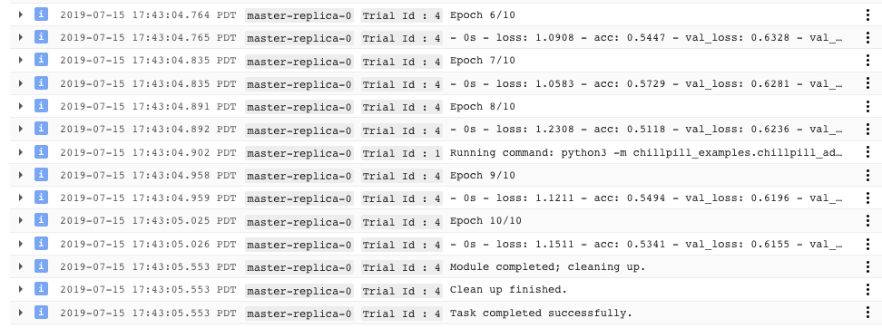
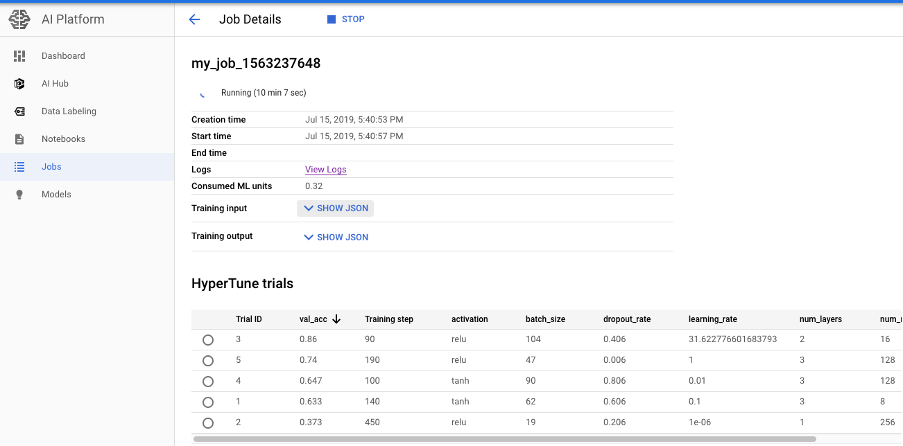

chillpill
=========
`chillpill` calms your hyperparameters for the cloud.  

Hyperparameter optimization is important to any deep learning workflow, but it's been difficult to do at scale. 
Until now.  

`chillpill` is designed with the goal of providing industrial-strength hyperparameter optimization with the least 
possible amount of work.  It runs on top of Google's Cloud AI Platform, but whereas Google's 
[raw hyperparameter tuning](https://cloud.google.com/ml-engine/docs/tensorflow/using-hyperparameter-tuning) 
may seem difficult to use, `chillpill` is easy.

Usage
-----
First you define your hyperparameter class by subclassing `params.ParameterSet`.  Define default hyperparameter 
values as class attributes on your subclass, just like you would on a dataclass<sup>1</sup>.
```python
from chillpill import params

class ModelHyperParams(params.ParameterSet):
    filter_size = 3
    num_hidden_layers = 2
    num_neurons_per_layer = 32
    dropout_rate = 0.5
    activation = 'relu'
    output_dir = '/tmp/output'
```

Next, create a train function which takes your hyperparameter type as an argument:
```python
def train_fn(hp: ModelHyperParams):
    # Your normal training code goes in a function like this.
    # Access your param values with `hp.filter_size` etc. 
    pass
```
and use your default hyperparameter values for development.

Then, when you want to run a hyperparameter search, instantiate a version of your `ModelHyperParams` class in 
which you replace the default parameters with the parameter ranges you'd like to consider in your search:
```python
my_param_ranges = ModelHyperParams(
    filter_size=params.DiscreteParameter([3, 5, 7]),
    num_hidden_layers=params.IntegerParameter(min_value=1, max_value=3),
    num_neurons_per_layer=params.DiscreteParameter(np.logspace(2, 8, num=7, base=2)),
    dropout_rate=params.DoubleParameter(min_value=-0.1, max_value=0.9),
    activation = 'relu',
)
```

Then create a search spec saying how many trials you'd like to complete and what parameter you'd like to optimize. 
Feed it your parameter values, your train function, and point it toward your cloud project.   
```python
# Create a Cloud AI Platform Hyperparameter Search object
from chillpill import search
searcher = search.HyperparamSearchSpec(
    max_trials=10,
    max_parallel_trials=5,
    max_failed_trials=2,
    hyperparameter_metric_tag='val_acc',
)
searcher.add_parameters(my_param_ranges)

# Run hyperparameter search job
searcher.run_from_trian_fn(
    train_fn=train_fn,
    train_params_type=my_param_ranges,
    cloud_staging_bucket='my-staging-bucket',
    gcloud_project_name='my-gcloud-project',
)
```

You'll get helpful output like this:
```
Job [my_job_1563237648] submitted successfully.
Your job is still active. You may view the status of your job with the command

  $ gcloud ai-platform jobs describe my_job_1563237648

or continue streaming the logs with the command

  $ gcloud ai-platform jobs stream-logs my_job_1563237648

You can see the results of your hyperparameter optimization at: 
  https://console.cloud.google.com/mlengine/jobs/my_job_1563237648/
```

Clicking the link above brings up a screen from which you can stream your workers' logs in real time:


And which will compile your parameter values and results into a table as they become available:


Requirements
------------
You need a [Google Cloud](https://cloud.google.com/deployment-manager/docs/step-by-step-guide/installation-and-setup) 
account with billing set up.  You get $300 of free credit and can run these samples for pennies.

`$ pip install --editable .` from within this directory.

Examples
--------
A complete example is available [here](https://github.com/kevinbache/chillpill_examples/tree/master/chillpill_examples/cloud_hp_tuning_from_train_fn).

If your training regimen has complex infrastructural dependencies (i.e.: you need to install non-Python packages)
you can instead bake your trainer into a Docker Container ([example](https://github.com/kevinbache/chillpill_examples/tree/master/chillpill_examples/cloud_hp_tuning_from_container)),
and if you have very simple Keras-based training job, you can run on your local machine ([example](https://github.com/kevinbache/chillpill_examples/tree/master/chillpill_examples/local_hp_tuning)). 

Details and Alternatives
------------------------
There are a few advantages to this approach.  

Using a single class to define both your hyperparameter values and their search ranges means that if you want 
to change the name of a hyperparameter value than you can just refactor it once in your IDE and it's changed 
everywhere.  

Defining hyperparameters as class members keeps you from having to type out
`self.param_name = param_name` for every parameter value and relieves you from having to rename members in both 
your `__init__` method definition and where you set it on `self` when you rename your parameters.  (Meanwhile, 
a small amount of `getattr`/`setattr` magic under the hood converts those class members 
into instance members when you instantiate your class so you don't have to worry about sharing members 
between insantiations of the same class.)


Notes
-----
<sup>1</sup> See the Details and Alternatives section for more about why using class members here is ok.